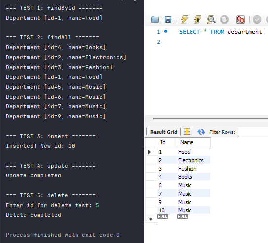
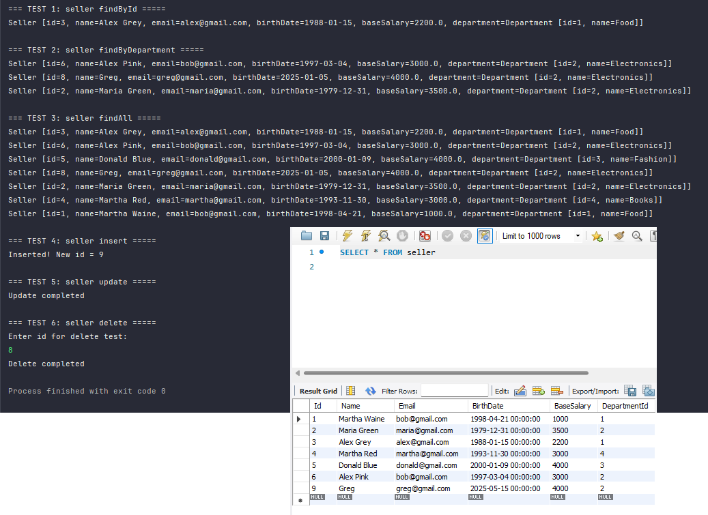
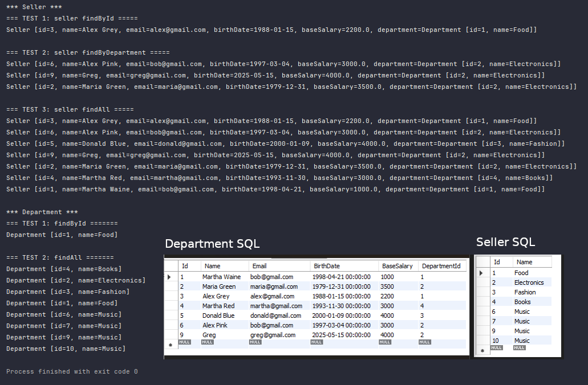
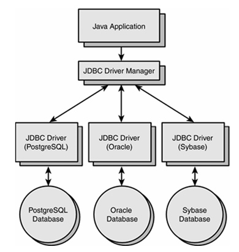
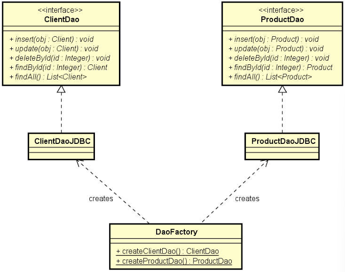

  

@author Daniel Gil 

# Acesso a banco de dados (MySQL Workbench) com JDBC 

*** Projeto apenas didático ***

Pequeno sistema que faz a conexão ao banco de dados com o JDBC com padrão DAO (Data Access Object) e servidor MySQL Workbench.

Objetivo geral: 
Conhecer os principais recursos do JDBC
Elaborar a estrutura básica de um projeto com JDBC 
Implementar o padrão DAO manualmente com JDBC 

### Department screenshot:

### Seller screenshot:

### Main App screenshot:

Visão geral do JDBC 
JDBC (Java Database Connectivity): API padrão do Java para acesso a dados 

Páginas oficiais:  
https://docs.oracle.com/javase/8/docs/technotes/guides/jdbc/ 

https://docs.oracle.com/javase/8/docs/api/java/sql/package-summary.html 

Pacotes: java.sql e javax.sql (API suplementar para servidores)

### API: 

- Statement 
- ResultSet 

	- first() [move para posição 1, se houver] 
	- beforeFirst() [move para posição 0] 
	- next()  [move para o próximo, retorna false se já estiver no último] 
	- absolute(int) [move para a posição dada, lembrando que dados reais começam em 1]

##  Inserir dados

### API: 

- PreparedStatement 
- executeUpdate 
- Statement.RETURN_GENERATED_KEYS 
- getGeneratedKeys 

#### Checklist: 

- Inserção simples com preparedStatement 
- Inserção com recuperação de Id

##  Atualizar dados

##  Deletar dados

#### Checklist: 

- Criar DbIntegrityException 
- Tratar a exceção de integridade referencial

##  Transações

Referências: https://www.ibm.com/support/knowledgecenter/en/SSGMCP_5.4.0/product-overview/acid.html

### API: 
- setAutoCommit(false) 
- commit() 
- rollback() 

## Padrão de projeto DAO (Data Access Object)  

Referências: 

https://www.devmedia.com.br/dao-pattern-persistencia-de-dados-utilizando-o-padrao-dao/30999 

https://www.oracle.com/technetwork/java/dataaccessobject-138824.html 

### Ideia geral do padrão DAO: 

Para cada entidade, haverá um objeto responsável por fazer acesso a dados relacionado a esta 
entidade.

Por exemplo: 
	
	Cliente: ClienteDao
	Produto: ProdutoDao
	Pedido: PedidoDao

- Cada DAO será definido por uma interface. 

- A injeção de dependência pode ser feita por meio do padrão de projeto Factory

### Department entity class 

#### checklist: 
- Attributes 
- Constructors 
- Getters/Setters 
- hashCode and equals 
- toString 
- implements Serializable

### Seller entity class 
 
### DepartmentDao and SellerDao interfaces 

### SellerDaoJDBC and DaoFactory

### findById implementation 

### findByDepartment implementation

### findAll implementation

### insert implementation

### update implementation 

### delete implementation